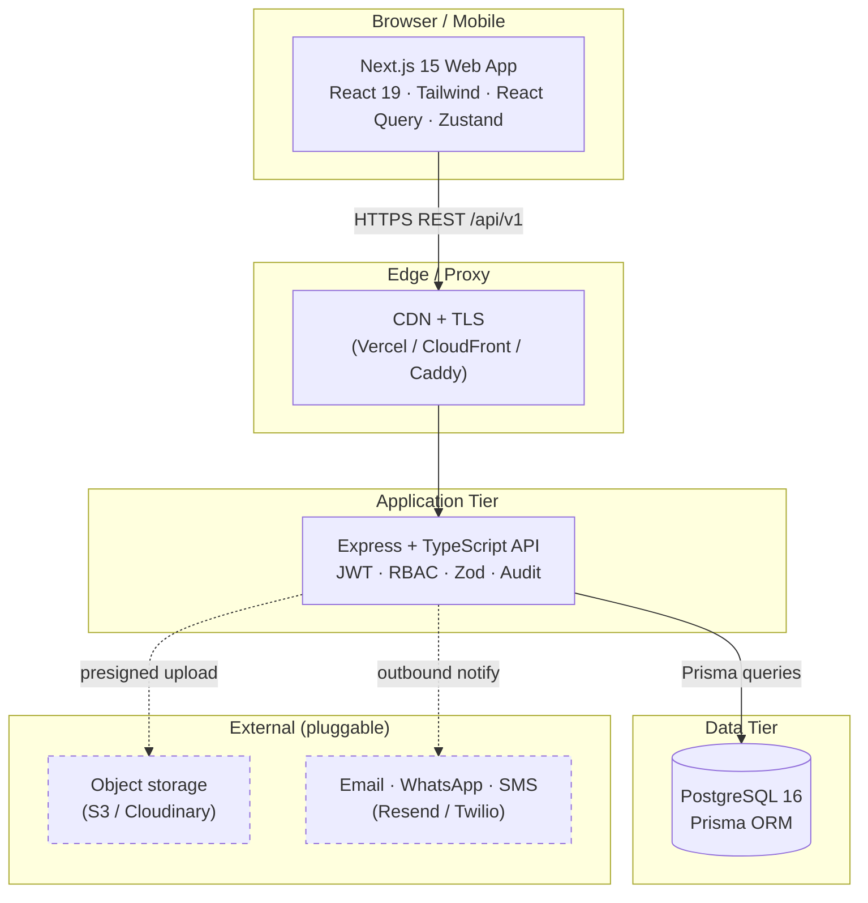
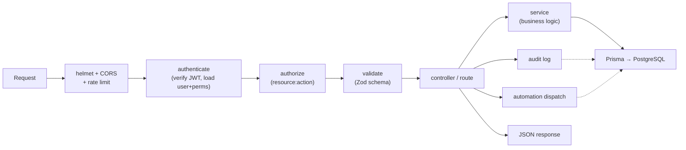
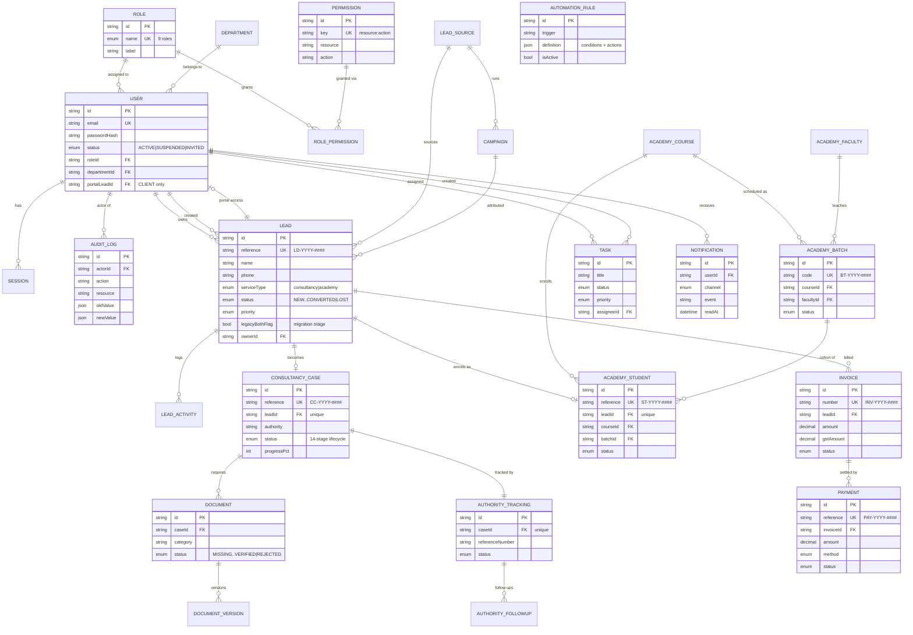
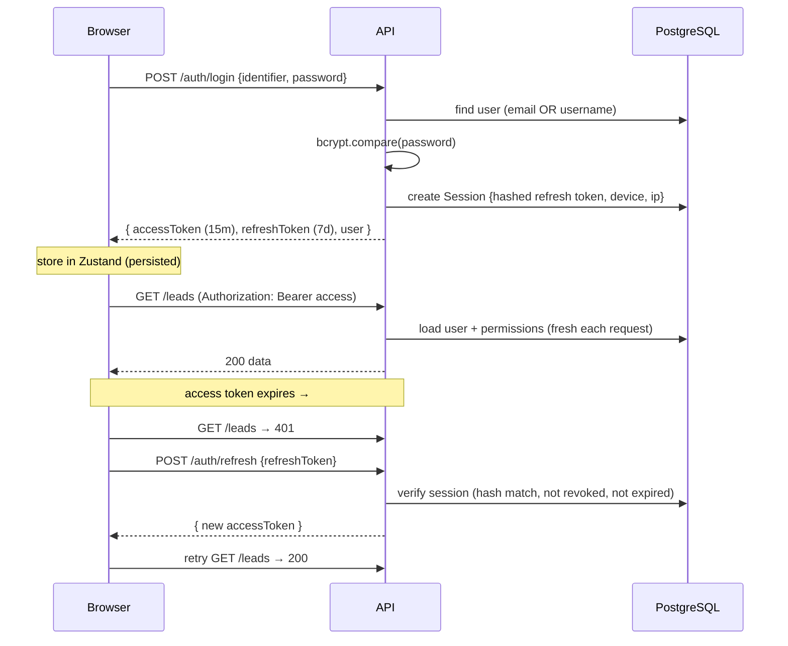
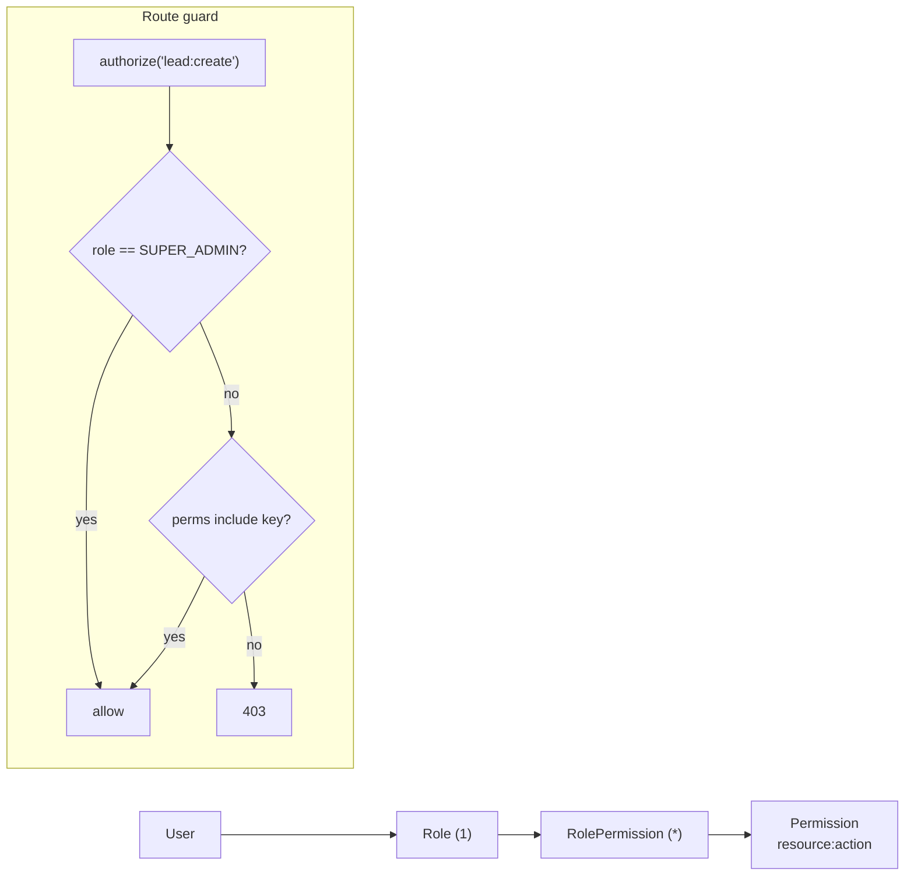
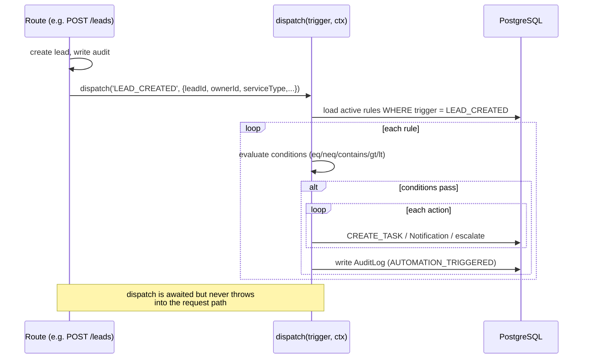

# Medline Ops — Architecture & Data Model

This document describes the system architecture, the entity-relationship model,
and the key runtime flows. Diagrams are written in **Mermaid** — they render on
GitHub and in most Markdown viewers (VS Code: install "Markdown Preview Mermaid
Support").

- [1. System architecture](#1-system-architecture)
- [2. Layered request lifecycle](#2-layered-request-lifecycle)
- [3. Entity-Relationship diagram](#3-entity-relationship-diagram)
- [4. Domain model notes](#4-domain-model-notes)
- [5. Authentication & session flow](#5-authentication--session-flow)
- [6. RBAC model](#6-rbac-model)
- [7. Automation engine flow](#7-automation-engine-flow)
- [8. Module & API map](#8-module--api-map)
- [9. Folder structure](#9-folder-structure)
- [10. Cross-cutting decisions](#10-cross-cutting-decisions)

---

## 1. System architecture



The web app is a **pure REST client** of the API (no SSR data coupling), so both
tiers deploy and scale independently. External integrations (file storage,
outbound messaging) are isolated behind seams and stubbed for local dev.

---

## 2. Layered request lifecycle

Every authenticated, mutating request flows through the same pipeline:



- **authenticate** re-loads the user's permissions from the DB each request, so
  a permission/role revocation takes effect immediately (no stale token claims).
- **audit** and **automation dispatch** are fire-and-forget side effects — they
  never block or break the user's response.

---

## 3. Entity-Relationship diagram



> Standalone tables not shown above (no foreign keys): `Refund`, `DemoSession`,
> `AutomationRule`, `Setting`, `GstRecord` is computed from invoices (not a table).

---

## 4. Domain model notes

**The "no Both" rule is structural.** `ServiceType` is a Postgres enum with only
`consultancy | academy`. There is no third value to accidentally use. Legacy
`both` rows are represented by `Lead.legacyBothFlag = true` (a boolean for
admin triage), **never** as an enum value — so it's impossible to create a new
"both" record anywhere in the system.

**A Lead is the spine.** Every customer enters as a `Lead`. On conversion it
fans out to exactly one of:
- a `ConsultancyCase` (service type `consultancy`) → documents, authority
  tracking, follow-ups, exam/license lifecycle, or
- an `AcademyStudent` (service type `academy`) → course, batch, progress,
  certification.

A `CLIENT` portal user is bound to their originating `Lead` via
`User.portalLeadId`, which is how the portal scopes every query to exactly one
person's data.

**Human-readable references** are generated per-year, zero-padded, and unique:
`LD-2026-0001`, `CC-2026-0001`, `ST-2026-0001`, `BT-2026-0001`,
`INV-2026-0001`, `PAY-2026-0001`.

**Money** uses `Decimal(12,2)` (never floats). Invoice status is **derived** from
confirmed payments (`PAID` / `PARTIALLY_PAID` / `OVERDUE`) via reconciliation,
not set by hand.

---

## 5. Authentication & session flow



Refresh tokens are **signed JWTs whose hash is stored server-side** in `Session`,
so they can be revoked (logout marks `revokedAt`). The web client refreshes
transparently via an Axios interceptor and retries the original request once.

---

## 6. RBAC model

Permissions are strings of the form `resource:action` (e.g. `lead:create`,
`report:export`). Roles are granted a set of permissions; `SUPER_ADMIN` bypasses
all checks.



- 26 resources × 10 actions are seeded as the permission catalogue.
- The matrix is seeded per role in `packages/db/prisma/seed.ts` and viewable at
  **Admin → Roles & Permissions**.
- `authenticate` flattens the role's permission keys onto `req.user.permissions`
  on every request; `authorize(...)` checks membership.

The 9 roles: `SUPER_ADMIN`, `OPERATIONS_MANAGER`, `SALES_MANAGER`,
`SALES_EXECUTIVE`, `DOCUMENTATION_TEAM`, `ACADEMY_HEAD`, `ACCOUNTS`,
`MARKETING`, `CLIENT`.

---

## 7. Automation engine flow



**Wired triggers:** `LEAD_CREATED`, `LEAD_ASSIGNED`, `LEAD_CONVERTED`,
`CASE_STATUS_CHANGED`, `PAYMENT_CONFIRMED`, `DOCUMENT_VERIFIED`,
`DOCUMENT_REJECTED`, `STUDENT_ENROLLED`.

**Actions** produce real effects: `CREATE_TASK` → `Task`; `SEND_NOTIFICATION /
EMAIL / WHATSAPP / SMS` → a channel-tagged `Notification` row **and**, for the
external channels, a real send via `lib/messaging.ts` (Resend for email, Twilio
for SMS/WhatsApp — skipped gracefully if unconfigured); `NOTIFY_MANAGER` →
`Notification`; `ESCALATE_CASE` → urgent Operations `Task`. Recipients resolve
from the event context (`lead_owner`, `managers`, `actor`, or an explicit user
id). In-app notifications surface in the bell + inbox; tasks land on the board.

---

## 8. Module & API map

All routes are under `/api/v1`. `*` = requires a matching `resource:action`
permission (Super Admin bypasses).

| Module | Base route | Key endpoints | Guard |
|--------|-----------|---------------|-------|
| Auth | `/auth` | login, refresh, logout, me | public / bearer |
| Dashboard | `/dashboard` | metrics | authenticated |
| CRM / Leads | `/leads` | list, get, create, update, assign, stats, check-duplicates | `lead:*` |
| Consultancy | `/consultancy` | cases, documents, authority, follow-ups, stats, meta | `case/document/authority:*` |
| Academy | `/academy` | courses, faculty, batches, students, demos, stats | `course/batch/student/...:*` |
| Accounts | `/accounts` | invoices, payments, gst, refunds, stats | `invoice/payment/refund:*` |
| Marketing | `/marketing` | sources, campaigns, stats | `campaign/lead_source:*` |
| Portal | `/portal` | overview, documents, payments, support | role `CLIENT` only |
| Automation | `/automation` | rules CRUD, meta | `automation:manage` |
| Notifications | `/notifications` | list, unread-count, read, read-all | own user |
| Tasks | `/tasks` | list, create, update | `task:*` |
| Reports | `/reports` | meta, run | `report:view` |
| Users | `/users` | list, options, create, update, assignable | `user:*` |
| Admin | `/admin` | roles, permissions, audit, settings | `role/audit/settings:*` |

---

## 9. Folder structure

```
medline-ops/
├── docker-compose.yml            # local Postgres
├── docker-compose.prod.yml       # full prod stack
├── packages/
│   └── db/                        # @medline/db — single source of truth
│       ├── prisma/
│       │   ├── schema.prisma      # all models + enums
│       │   └── seed.ts            # 9 users, RBAC matrix, demo journey
│       └── src/index.ts           # exported Prisma client + types
└── apps/
    ├── api/                       # @medline/api — Express + TS
    │   ├── Dockerfile
    │   └── src/
    │       ├── server.ts · app.ts # bootstrap + middleware chain
    │       ├── config/env.ts
    │       ├── lib/               # jwt · audit · http-error · async-handler
    │       ├── middleware/        # authenticate · authorize · validate · errors
    │       └── modules/           # one folder per domain
    │           ├── auth/ leads/ consultancy/ academy/ accounts/
    │           ├── marketing/ portal/ automation/ notifications/
    │           └── tasks/ reports/ admin/ users/ dashboard/
    │               └── *.routes.ts · *.service.ts · *.schema.ts
    └── web/                       # @medline/web — Next.js 15 App Router
        ├── Dockerfile
        └── src/
            ├── app/
            │   ├── login/         # public
            │   └── (app)/         # authed shell (sidebar + topbar)
            │       ├── dashboard/ leads/ consultancy/ academy...
            │       ├── portal/    # client self-service
            │       └── [...slug]/ # roadmap placeholder
            ├── components/        # ui · drawer · sidebar · topbar · dashboards/
            ├── config/nav.ts      # per-role navigation
            └── lib/               # api (axios) · auth-store (zustand) · types
```

Each API module is a consistent triplet: **routes** (HTTP + guards + audit) →
**service** (business logic + Prisma) → **schema** (Zod validation). New modules
follow the Leads module as the reference pattern.

---

## 10. Cross-cutting decisions

| Concern | Decision | Where |
|---------|----------|-------|
| Validation | Zod at the edge; `req.body` replaced with typed result | `middleware/validate.ts` |
| Errors | `HttpError` + central handler maps Zod/Prisma → clean JSON | `middleware/error-handler.ts` |
| Auth | Short access JWT + DB-backed refresh rotation w/ revocation | `modules/auth`, `lib/jwt.ts` |
| Authorization | `resource:action` perms, fresh per request, SA bypass | `middleware/authorize.ts` |
| Audit | Append-only `AuditLog` on every mutation; never throws | `lib/audit.ts` |
| Money | `Decimal(12,2)`; invoice status derived from payments | `modules/accounts` |
| Multi-tenant readiness | Strict per-user scoping (portal `portalLeadId`, notifications by `userId`, exec leads by `ownerId`) | services |
| Client state | React Query (server cache) + Zustand (auth/session) | `web/src/lib` |
| Idempotent seeds | upsert by unique reference/email keys | `prisma/seed.ts` |

See [`DEPLOYMENT.md`](DEPLOYMENT.md) for how these run in production.
